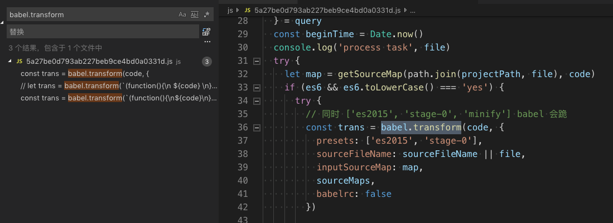
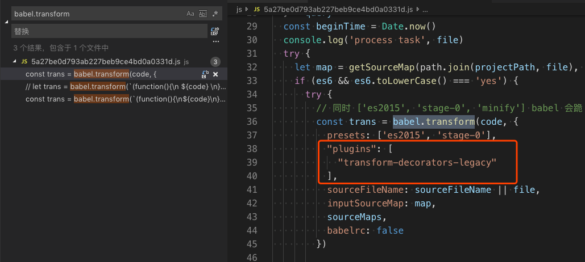

# 让小程序开发工具支持 decorator

- 找到 package.nw (mac 在 Contents/Resources/package.nw), 用 visual studio code 打开
- 在该目录下添加依赖 `babel-plugin-transform-decorators-legacy`
```
npm install babel-plugin-transform-decorators-legacy@1.3.5
```
- 用 vscode 搜索 `babel.transform`



- 添加 `transform-decorators-legacy`
```
"plugins": [
    "transform-decorators-legacy"
],
```


- 重启开发者工具

- 测试
```js
function testable(target) {
  target.isTestable = true;
}

@testable
class MyTestableClass {
  // ..
}

console.info(MyTestableClass.isTestable); // true
```
