title: 小程序开发基础

[slide]

# 小程序开发基础

[slide]

- 申请小程序
- Hello Word
- 发布小程序

[slide]

# 注册小程序

- 通过公众平台直接注册 https://mp.weixin.qq.com
- 通过公众号快速注册并认证小程序

    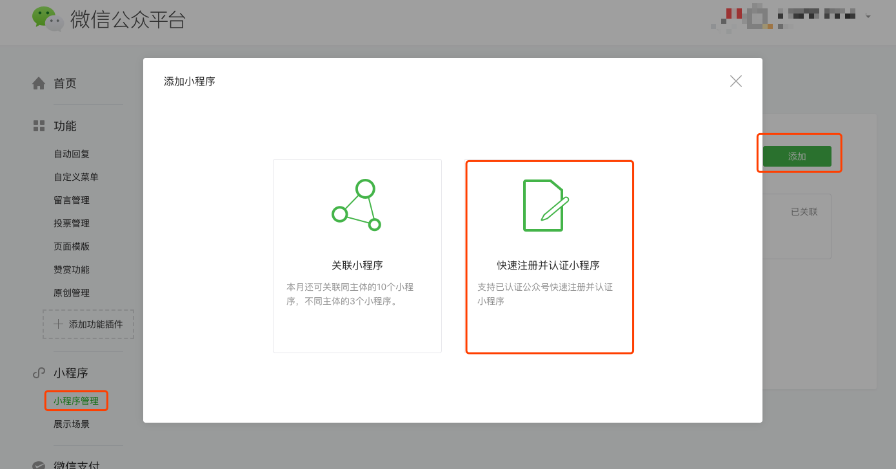

[slide]

# 注册范围

- 个人主体的小程序肯定是无法完整地使用小程序的接口和能力的，具体哪些接口用不了呢
    - 微信支付
    - 卡券
    - 获取微信用户绑定的手机号码
    - 附近的小程序
    - ...

    

[slide]

# 注册页面

- 这里的邮箱需要在开`放平台`，`公众平`台下唯一
- 需要 `管理员`，一个微信号下不超过 5个小程序

    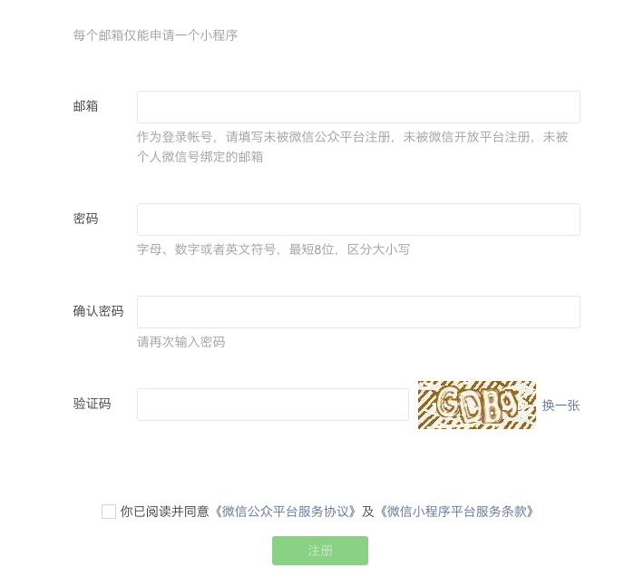

[slide]

# 填写小程序信息

- 服务范围与资质证明 https://developers.weixin.qq.com/miniprogram/product/material.html
- 资质证明是最常见的审核被拒绝的原因

    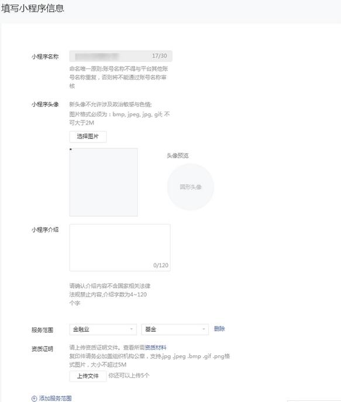

[slide]

# 查看小程序设置

- appid 就是这个小程序的唯一标识
- appSecret 访问腾讯 api 的密钥

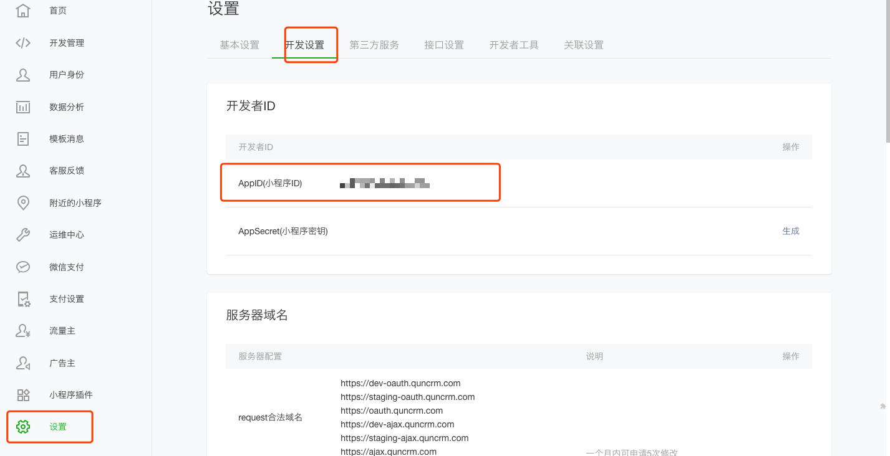

[slide]

# 添加开发者，测试者

- 一般情况下给`开发者权限`， `体验者权限`

    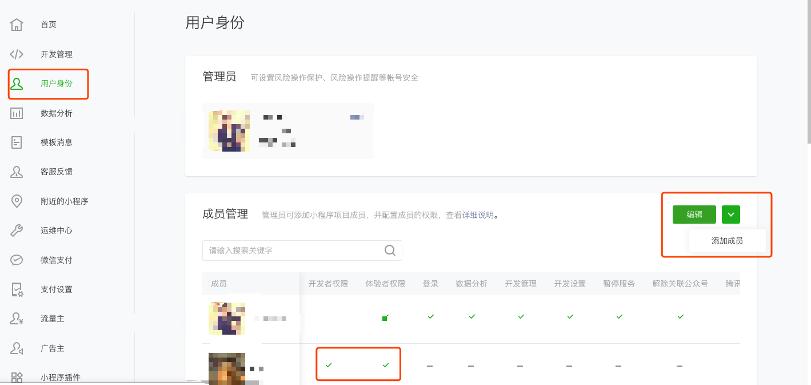

[slide]

# 账号限制

- 小程序成员管理和限制 http://kf.qq.com/faq/170302zeQryI170302beuEVn.html
- `公众平台安全助手` 公众号查询公众号，小程序，开放平台绑定信息

    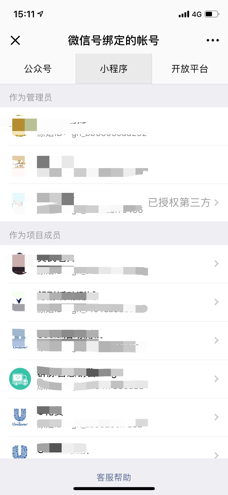

[slide]

# 安装开发工具

- 下载地址 https://developers.weixin.qq.com/miniprogram/dev/devtools/download.html
    - 官方仅支持 windows 和 mac
    - linux 可以通过一些特殊手法支持，但是效果很差 https://github.com/cytle/wechat_web_devtools
- 运行开发工具

    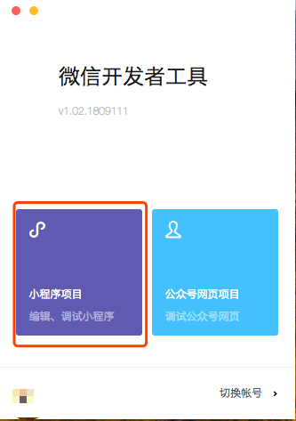

[slide]

# 第一个小程序

- `appid` 在小程序设置里
- 选择`小程序`类型
- 选择`建立普通快速启动模板`

    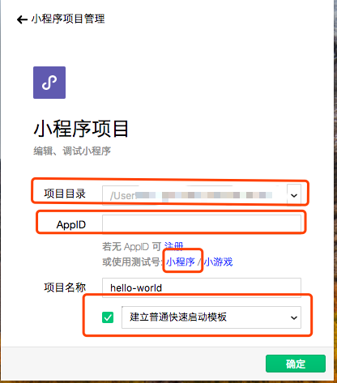

[slide]

# 项目配置

- project.config.json https://developers.weixin.qq.com/miniprogram/dev/devtools/projectconfig.html

    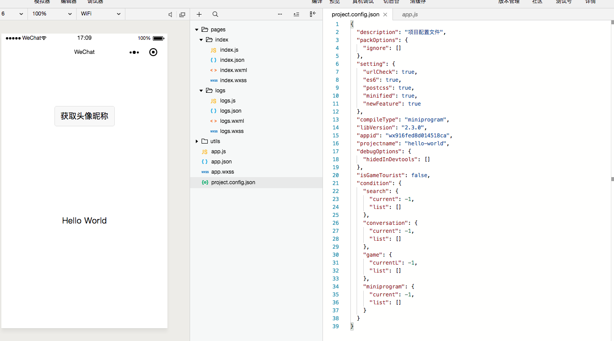

[slide]

# 小程序配置

- [app.json](https://developers.weixin.qq.com/miniprogram/dev/framework/config.html)
- [app.js](https://developers.weixin.qq.com/miniprogram/dev/framework/app-service/app.html)
- app.wxss

    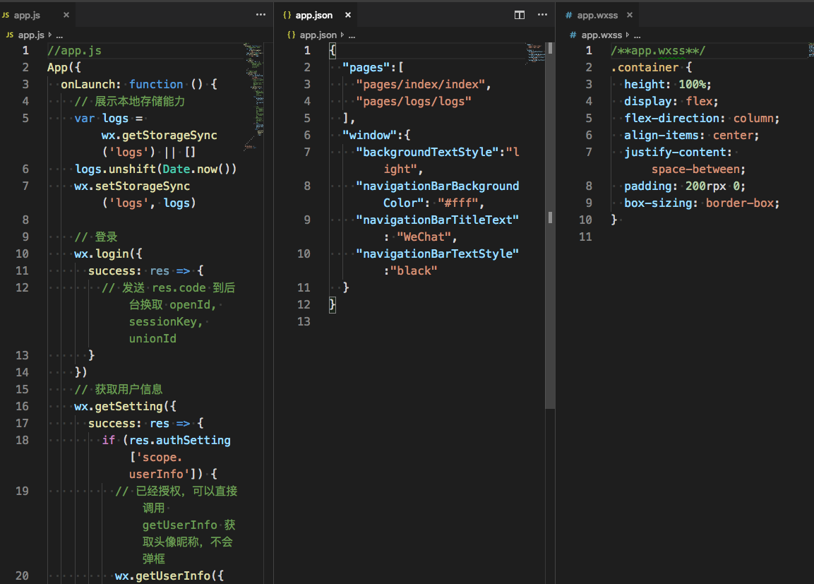

[slide]

# 小程序页面

- [index/index.js](https://developers.weixin.qq.com/miniprogram/dev/framework/app-service/page.html)
- [index/index.wxml](https://developers.weixin.qq.com/miniprogram/dev/framework/view/wxml/)
- [index/index.wxss](https://developers.weixin.qq.com/miniprogram/dev/framework/view/wxss.html)
- [index/index.json](https://developers.weixin.qq.com/miniprogram/dev/framework/config.html#%E9%A1%B5%E9%9D%A2%E9%85%8D%E7%BD%AE)

    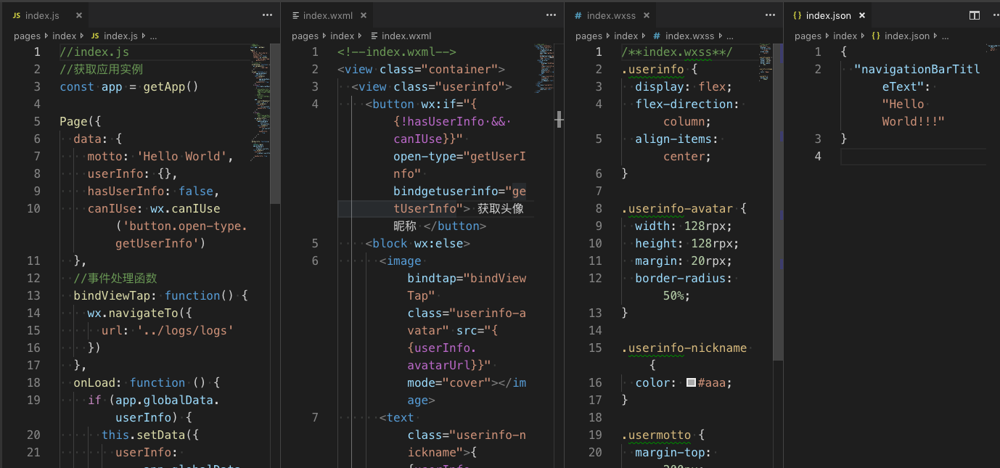

[slide]

# 预览/上传小程序
- 开发预览
- 真机预览
- 上传体验版

    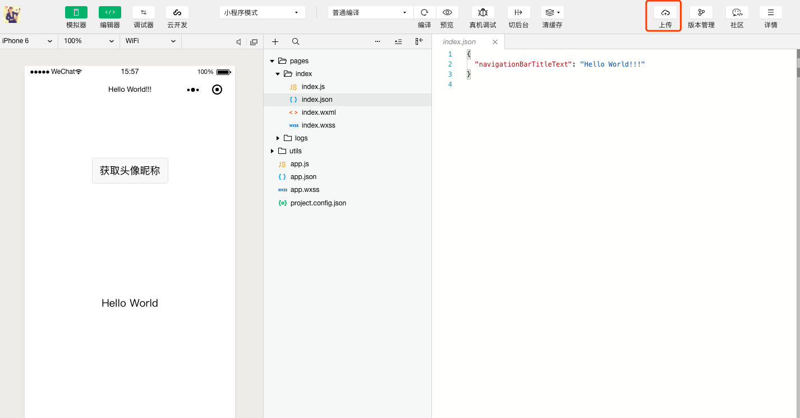

[slide]

# 选为体验版

- 体验码和路径有关，如果路径不修改二维码会一直有效
- 一个小程序只能把一个人的上传版本设为体验版

    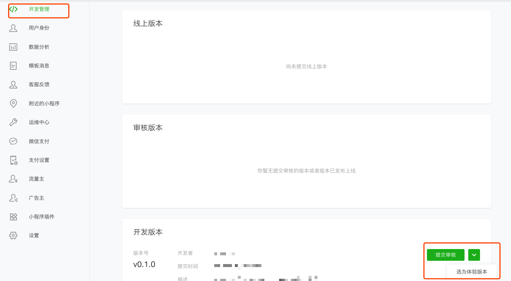

[slide]

# 提交审核
- 审核一般半天时间，但是极端情况遇到审核了一周
- 提交审核的人和管理员会受到审核结果通知

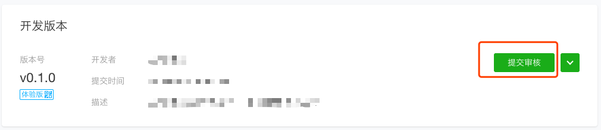

[slide]

# 填写审核信息
- 一般只添加首页

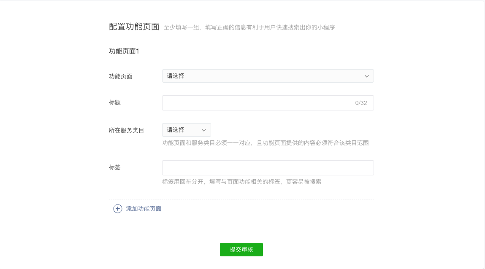

[slide]

# 发布小程序

- 支持阶段发布

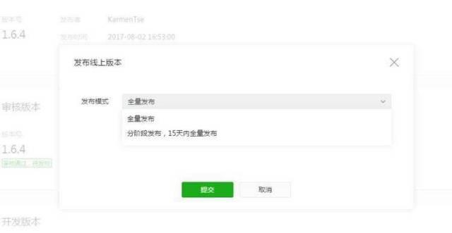

[slide]

# 小程序入口

- scene https://developers.weixin.qq.com/miniprogram/dev/framework/app-service/scene.html

    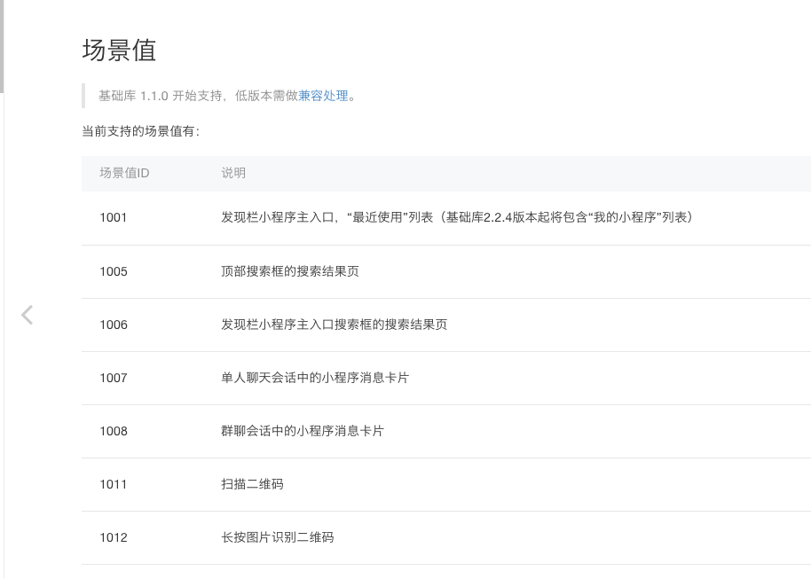

[slide]

# 参考

- https://developers.weixin.qq.com/miniprogram/dev/index.html
- https://developers.weixin.qq.com/community

[slide]

# Thanks
